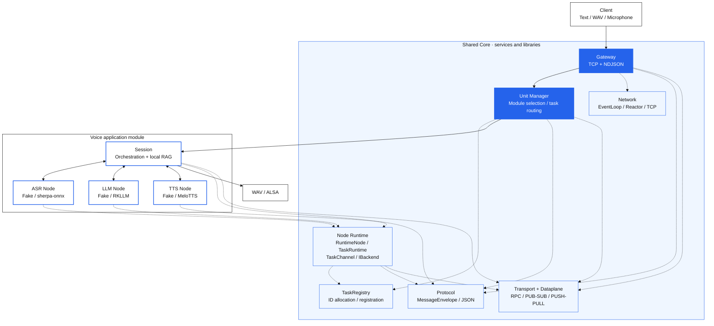

<div align="center">


# SlotNexus

**A shared foundation for communication, task routing, and inference across edge models.**

Multi-process communication and inference middleware for Linux edge devices, with fully offline voice interaction as its first application module.


[简体中文](README.md) · **English**

[Quick start](#quick-start) · [Motivation](#why-this-middleware) · [Architecture](#architecture) · [Voice module](#voice-module) · [Board deployment](#board-deployment) · [Validation](#validation) · [Module development](#module-development) · [Project structure](#project-structure-and-responsibilities)

</div>

> [!NOTE]
> **Current version: 0.2.0.** The default build uses Fake Backends and requires no models, NPU SDK, or audio device. The real voice pipeline has been validated on the RK3576 TaishanPi 3M (4 GB). Other Linux edge platforms remain adaptation targets. See [Validation](#validation) for measured results and current limitations.

## Overview

SlotNexus targets **Linux edge computing platforms including Huawei Ascend, Kunpeng, Rockchip RK series, and Horizon RDK series**, providing shared communication and task management for LLM, ASR, TTS, and other models in resource-constrained environments. It runs model nodes in separate processes and coordinates inference through a common protocol, reducing the coupling between application code and node addresses, connection management, and model interfaces.

The shared Core provides the Gateway, task routing, transport, and Node Runtime. Application modules own model loading, audio processing, knowledge stores, and business orchestration. Core can be built, tested, and installed independently; modules integrate through public CMake targets or the installed `slotnexus-core` package.

### Why this middleware

Putting ASR, retrieval, LLM, and TTS in one application process means application code must also manage model resources, sockets, threads, streaming output, and abnormal shutdowns. SlotNexus provides shared mechanisms for these recurring problems:

| Common edge deployment problem | How SlotNexus addresses it |
| --- | --- |
| Models compete for CPU, NPU, and memory; a node failure affects the pipeline | Model nodes are isolated in separate processes; Manager allocates and tracks tasks, with failures handled at the node level |
| Models have different loading, inference, cancellation, and shutdown interfaces | The shared Node Runtime manages `setup / inference / cancel / taskinfo / exit`; application modules adapt their specific Backends |
| Audio frames, recognition segments, tokens, and PCM arrive continuously and can accumulate | Control RPC and asynchronous data events are separated; queue capacity, wait times, and message sizes are bounded |
| Hardcoded node addresses couple clients to deployment details | Gateway provides one entry point; Manager routes using module configuration and `work_id`, with node endpoints configured centrally |
| Multiple turns, cancellation, and late events can mix streams | `work_id`, `request_id`, and `session_id` identify tasks and requests; Voice Session uses generation identifiers to filter old events |

The current implementation focuses on **multiple processes on one host, operating offline**. Communication and inference are split across processes using TCP / ZeroMQ; Gateway and internal nodes require no public internet service. Cross-host clusters and automatic failover are not currently provided.

**The validated platform is RK3576 TaishanPi 3M (4 GB).** Other platforms remain architectural adaptation targets, and model Backends require platform-specific implementation or adaptation. Modules are integrated by installation, configuration, and service restart.

## Quick start

### 1. Install dependencies

Use Linux or WSL2 with a C++17 compiler, CMake ≥ 3.22, and Python 3. On Ubuntu 22.04:

```bash
sudo apt update
sudo apt install -y build-essential cmake python3 libzmq3-dev cppzmq-dev
```

The repository includes the complete `nlohmann/json` 3.10.5 headers. The default build requires no vendor SDKs, models, or audio hardware.

### 2. Build and test

After obtaining the source, run these commands from the repository root:

```bash
cmake --preset wsl-debug
cmake --build --preset wsl-debug
ctest --preset wsl-debug -j1
```

The `wsl-debug` preset uses Unix Makefiles and also works on Linux. Tests generate minimal WAV fixtures. Some E2E tests use local ports, so run CTest serially as shown.

### 3. Run the demo

```bash
bash scripts/demo_mock_session.sh
```

The demo covers L0–L3 routing, fixed WAV input, task status, and WAV output. The terminal shows `route`, `status`, and `final_text`; logs and audio are written to `/tmp/slotnexus-session/`. Fake TTS produces a test tone for validating the audio path. Read the answer in `final_text`.

The demo terminates existing processes named `edge_gateway`, `unit_manager`, and `session_node`; run it in an isolated development environment.

<details>
<summary><strong>Build Core only, or build the voice module against an installed Core</strong></summary>

```bash
cmake -S . -B build-core -DVOX_BUILD_VOICE=OFF -DVOX_BUILD_TESTS=ON
cmake --build build-core -j4
ctest --test-dir build-core -j1 --output-on-failure
cmake --install build-core --prefix "$PWD/build-core-install"

cmake -S modules/voice -B build-voice \
  -DCMAKE_PREFIX_PATH="$PWD/build-core-install"
cmake --build build-voice -j4
```

The standalone voice build consumes Core through `find_package(slotnexus-core CONFIG REQUIRED)` and does not enable cross-process voice tests by default. Use the repository root build for the full test suite.

</details>

## Architecture



Solid arrows show the main request and data flow; dashed arrows show dependencies on shared Core components. Core library boxes are capabilities reused within processes, not additional services. Dashed links highlight the main component dependencies; the diagram is not an exhaustive CMake dependency graph.

The board deployment uses **six processes: Gateway, Manager, Session, ASR, LLM, and TTS**. RAG runs inside Session; the module also retains a standalone `rag_node` entry point.

Control requests use ZeroMQ RPC. ASR frames travel upstream over PUSH/PULL, while recognition segments, LLM tokens, and TTS PCM are published through PUB/SUB. Core carries generic JSON `payload` values and events; audio types and model SDKs remain in the voice module.

ASR, LLM, and TTS nodes reuse the `RuntimeNode`, `TaskRuntime`, and `IBackend` contracts. Session uses its own voice orchestration implementation and connects to model nodes through network Backends. Manager uses round-robin selection within a module and a fixed route within a task. The Gateway currently uses one EventLoop and waits synchronously for Manager RPC; slow requests delay processing of other connections.

[Detailed design (Chinese)](docs/architecture.md) · [Core and module integration contract (Chinese)](middleware/MODULE_INTEGRATION.md) · [Core dependency boundary check](scripts/check_core_boundary.sh)

## Voice module

| Stage | Default development build | Real RK3576 Backend |
| --- | --- | --- |
| ASR | Fake ASR | sherpa-onnx streaming recognition, fp32 by default |
| Retrieval and routing | JSONL + BM25 | Same implementation: L0 control, L1 direct factual answers, L2 retrieval-augmented generation, L3 general generation |
| LLM | Fake LLM | RKLLM; Qwen3.5-0.8B W4A16 G128 |
| TTS | Fake TTS | MeloTTS: ONNX Runtime CPU encoder + RKNN NPU decoder |
| Output | WAV | WAV / ALSA |

Session splits generated answers into text chunks, sends playable text to TTS, and submits output through a bounded PCM queue. Real models, knowledge stores, and recordings are supplied through external paths. The repository includes a small [example knowledge store](modules/voice/examples/knowledge.jsonl).

| Input mode | Behavior |
| --- | --- |
| Text / fixed WAV | One request performs routing, answer generation, and output; WAV input requires 16 kHz, mono, 16-bit PCM |
| `mode=stream` | Continuous capture within one request, with ASR / VAD endpoint detection |
| `mode=continuous` | An explicitly started multi-turn session; supports continuation after short pauses and returns to sleeping on a sleep phrase, idle timeout, session duration limit, or turn limit |

Continuous mode uses no wake word or KWS. An observation window merges resumed speech and cancels outdated speculative inference before the first PCM frame is committed. Barge-in during playback and AEC are not implemented.

[Voice configuration template](modules/voice/config/taishanpi3m/session.json) · [Models and dependencies (Chinese)](modules/voice/models/README.md)

## Board deployment

The validation platform is **RK3576 TaishanPi 3M with 4 GB RAM**. The real pipeline requires external sherpa-onnx, RKLLM, ONNX Runtime, RKNN, ALSA, and compatible models.

1. Prepare system packages, runtimes, models, and fixed WAV inputs using the [deployment manifest (Chinese)](modules/voice/deploy/taishanpi3m/deploy-manifest.md).
2. Set the dependency roots and model environment variables required by the scripts, and check paths in the [hardware configuration](modules/voice/config/taishanpi3m/session.json).
3. Run the native build, preflight check, and startup from the repository root on the board:

```bash
bash modules/voice/deploy/taishanpi3m/build.sh hardware
bash modules/voice/deploy/taishanpi3m/check_deployment.sh
bash modules/voice/deploy/taishanpi3m/start.sh
```

`build.sh hardware` checks required `SLOTNEXUS_*` parameters, runs tests, and caps parallelism at four jobs. `start.sh` starts all six services and performs model setup. Logs default to `/tmp/slotnexus-runtime/`; use `stop.sh` to stop the services.

Select output with `SLOTNEXUS_SINK=wav` (default) or `SLOTNEXUS_SINK=alsa`. Set the audio device with `SLOTNEXUS_SINK_DEVICE`. Measurement scripts manage their own processes; stop existing services before running them:

```bash
bash modules/voice/deploy/taishanpi3m/stop.sh
bash modules/voice/deploy/taishanpi3m/run.sh wav
```

<details>
<summary><strong>Measurement and regression scenarios</strong></summary>

| `run.sh` scenario | Purpose |
| --- | --- |
| `baseline [directory]` | Startup, model loading, handshake, setup, inference timing, and resource samples |
| `wav` | Full pipeline regression with demo_zh and official 0.wav inputs |
| `mic` | Microphone capture until silence ends a single turn |
| `stability [rounds]` | Availability regression recreating all six processes each round; 30 rounds by default |
| `inject` | Cancellation, node timeouts, and invalid input |
| `llm` | Fixed-prompt verification of llm_node alone |
| `mock` | Fake Backend checks using the default build artifacts |

Artificial stage delays default to zero. Set `SLOTNEXUS_STAGE_DELAY_MS` explicitly to simulate a slow consumer. The `stability` scenario recreates processes each round and uses a different methodology from the resident-process performance results below.

</details>

## Validation

### Functionality and builds

| Scope | Recorded validation |
| --- | --- |
| Default WSL build | 54/54 serial CTest passes at `3b1a503`, covering behavior, routing, Core boundaries, and deployment script contracts |
| Independent Core delivery | 17/17 CTest passes at the refactoring acceptance checkpoint; Core installation and standalone voice consumer build passed |
| Real RK3576 pipeline | 14/14 voice-related CTest passes after the Decoder slicing change; fixed WAV regression verified ASR text, routing, and 18 RIFF/WAVE outputs |
| Task cleanup and cancellation | Recorded checks cover cancellation before old PCM is committed, successful subsequent requests, task release on exit, and successful setup again; cancellation path constraints are listed below |

Counts refer to their respective commits and test scopes. They do not imply that every hardware test ran in one combined execution.

### Resident-process performance

Conditions: TaishanPi 3M / RK3576 / 4 GB, Ubuntu 24.04.4, Linux 6.1.99, Release build, **WAV output**, and zero artificial stage delay. The six processes are started and set up once, followed by 30 ordinary requests per group. L1 uses `demo_zh.wav`; L3 uses official `0.wav` with a 128-token LLM output budget.

| Metric | Before optimization `597087a^` | Current `3b1a503` |
| --- | ---: | ---: |
| L1 output completion p50 / p95 | 6105 / 6540 ms | 4002 / 4446 ms |
| L3 output completion p50 / p95 | 22909 / 23464 ms | 18448 / 18803 ms |
| L3 session first PCM p50 | 4279 ms | 3995 ms |
| L3 TTS synthesis RTF | 0.507 | 0.272 |
| Successful requests per group | 30/30 | 30/30 |

The results reflect the combined MeloTTS resampling and Decoder slicing improvements. Comparing `597087a` → `3b1a503` separately, Decoder runs across 390 L3 TTS calls dropped from 1145 to 918, the minimum required to cover those inputs consecutively with the current 128-frame window.

- **Output completion**: time from the start of a session request to closing the output; WAV means file completion, while ALSA includes drain. The table uses WAV only.
- **Session first PCM**: time from request start to the first TTS PCM event, including preceding recognition, routing, and generation waits. First PCM within an individual TTS synthesis call has a different starting point and is excluded from this table.
- **RTF**: cumulative TTS synthesis time divided by generated audio duration; lower is better.

CPU/NPU frequencies were not locked. The p95 values are descriptive statistics from 30 rounds, and RSS observations cover those rounds only. Software first PCM and WAV completion do not measure actual speaker onset or acoustic playback completion.

`run.sh baseline` / `wav` reproduce single-round measurements and correctness checks. **The fixed resident-process 30-round benchmark script is not yet included in the repository.** `run.sh stability` recreates processes each round and does not directly reproduce this table.

### Current limitations

- **Deployment and recovery**: single-host, multi-process operation; no cross-host cluster, automatic failover, automatic device / model node recovery, dynamic module loading, or hot plugging.
- **Cancellation and concurrency**: synchronous Gateway forwarding and serial node REQ/REP constrain cancellation delivery during inference. Backends use cooperative cancellation. L0 stop rules do not provide arbitrary preemption, and no high-concurrency capacity claim has been measured.
- **Event reliability**: PUB/SUB provides subscription handshakes and correlation identifiers, but no persistence, replay after disconnect, or delivery acknowledgement.
- **Voice interaction**: no AEC or barge-in during playback. PCM frames are written sequentially to ALSA without a separate startup prebuffer or playback preemption. Short-pause continuation cancels outdated inference only before the first frame is committed.
- **Hardware and quality coverage**: this resident-process performance regression excludes live ALSA playback, continuous-capture shutdown with an audio device, and acoustic onset / cancellation-to-silence measurements. Low-quality or short inputs can still yield an empty ASR final. Decoder seam listening covered one text only; numbers, long sentences, and mixed Chinese/English need broader listening checks.
- **Further optimization**: Decoder re-export / shorter windows and an NPU Encoder evaluation require additional model conversion materials.

## Module development

Place new modules under `modules/<name>`. Implement module-specific nodes, Backends, request `payload` values, and event `kind` values. Build against public Core targets or an installed `slotnexus-core`, then register the module and endpoints in Manager configuration.

The [module integration guide (Chinese)](middleware/MODULE_INTEGRATION.md) provides a directory template, target selection, the `IBackend` contract, and standalone build commands. The [voice module descriptor](modules/voice/config/manager-modules.json) is a configuration example.

A second application module has not yet completed end-to-end integration validation. Adding modules without changing Core source is the current interface design goal.

## Project structure and responsibilities

Source is organized as **shared Core mechanisms → application modules → tests and delivery**. The tree shows the main directories, omitting repeated `include/`, `src/`, and nested `CMakeLists.txt` files:

```text
slotnexus/
├── CMakeLists.txt                 # Root build: Core + optional voice + tests
├── CMakePresets.json              # Default Linux / WSL development build
├── middleware/                   # Shared Core; no voice or vendor SDK dependencies
│   ├── common/                   # Bounded queues, logging, Base64, version utilities
│   ├── protocol/                 # MessageEnvelope, JSON serialization, protocol validation
│   ├── transport/                # ZeroMQ RPC, PUB/SUB, PUSH/PULL wrappers
│   ├── network/                  # epoll Reactor, EventLoop, TCP, NDJSON framing
│   ├── task_registry/            # work_id allocation and task registration
│   ├── runtime/                  # IBackend, TaskChannel, TaskRuntime
│   ├── dataplane/                # Generic JSON events, pub/sub, stream correlation
│   ├── services/                 # Service implementations, public headers, executables
│   │   ├── edge_gateway/         # TCP entry point and Manager RPC forwarding
│   │   ├── unit_manager/         # Module selection, round robin, task routing
│   │   ├── node_host/            # RuntimeNode: RPC actions and task execution adapter
│   │   └── echo_node/            # Generic node example
│   └── cmake/                    # Installed slotnexus-core package configuration
├── modules/voice/                # Voice application; owns model and audio dependencies
│   ├── common/                   # WAV reading, text chunking, voice event conversion
│   ├── backends/                 # contract / fake / net / vendor implementations
│   ├── rag/                      # Normalization, knowledge store, BM25, L0–L3 routing
│   ├── session/                  # Pipeline, streaming input, continuous interaction rules
│   ├── nodes/                    # Session, ASR, LLM, TTS, RAG, and voice_cli
│   ├── config/                   # mock / taishanpi3m settings and Manager module descriptor
│   ├── deploy/taishanpi3m/        # Build, preflight, lifecycle, board measurements
│   ├── examples/                 # Minimal example knowledge store
│   ├── models/                   # Model source documentation; no model files
│   └── tests/                    # unit / integration / e2e / fault
├── tests/core/                   # Core unit, integration, and boundary regression
├── scripts/                      # Demos, protocol probes, fixtures, dependency checks
├── docs/                         # Project design documentation
├── assets/                       # README presentation assets
└── third_party/nlohmann/         # Bundled JSON headers
```

### How the layers work together

| Layer | Responsibilities and boundaries |
| --- | --- |
| Networking and transport | `network/` handles TCP connections and the event loop; `transport/` wraps ZeroMQ for services and modules |
| Protocol and data events | `protocol/` defines generic envelopes; `dataplane/` organizes asynchronous events, whose business meaning is interpreted by modules |
| Tasks and nodes | `runtime/` manages task state and calls `IBackend`; `services/node_host/` connects it to RPC and event channels |
| Entry point and routing | Gateway accepts external requests; Manager stores task-to-node routes, while `task_registry/` allocates identifiers and registers tasks |
| Voice application | Session uses voice Backend contracts; `backends/net/` wraps remote nodes as ASR / LLM / TTS interfaces, and the nodes adapt model implementations to Core `IBackend` |
| External dependencies | `backends/contract/`, `fake/`, and `net/` are included by default; `sherpa_onnx/`, `rkllm/`, `melotts/`, and `alsa/` are enabled by the hardware build option |

`services/` contains both service libraries and executable entry points. `node_host/` provides a reusable library, not a separate node_host process. The default demo and real board deployment use different process combinations; directory counts do not indicate resident process counts.

Start with the [root CMake](CMakeLists.txt) and [Core build entry point](middleware/CMakeLists.txt) for build boundaries, then follow [Gateway](middleware/services/edge_gateway/edge_gateway.cpp) → [Manager](middleware/services/unit_manager/unit_manager.cpp) → [Session](modules/voice/nodes/session_node/session_node.cpp) → [voice pipeline](modules/voice/session/src/session_pipeline.cpp). See [RuntimeNode](middleware/services/node_host/runtime_node.cpp) and [IBackend](middleware/runtime/include/slotnexus/runtime/ibackend.hpp) for generic node execution.

## License and author

Project-owned code is licensed under the [MIT License](LICENSE). Author: **Caden**. See [THIRD_PARTY_NOTICES.md (Chinese)](THIRD_PARTY_NOTICES.md) for third-party components, model sources, and distribution boundaries. Models, vendor SDKs, and external shared libraries are supplied by the deployment environment and are not distributed with the source repository.