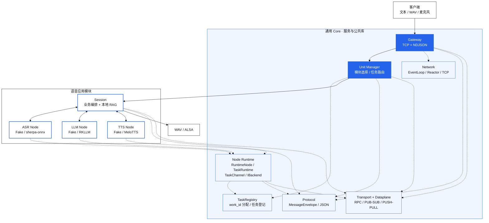

<div align="center">


# SlotNexus

**让端侧模型各司其职，让通信、调度与推理协作有统一底座。**

面向 Linux 边缘设备的多进程通信与推理中间件，以全离线语音交互作为首个应用模块。


**简体中文** · [English](README.en.md)

[快速开始](#快速开始) · [设计动机](#为什么需要这套中间件) · [架构](#架构) · [语音模块](#语音模块) · [板端部署](#板端部署) · [验证结果](#验证结果) · [模块开发](#模块开发) · [目录详解](#项目目录与职责)

</div>

> [!NOTE]
> **当前版本：0.2.0。** 默认构建使用 Fake Backend，无需模型、NPU SDK 或声卡即可体验。真实语音链路已在 RK3576 泰山派 3M（4 GB）验证；其他 Linux 边缘平台仍属于适配目标。实测数据与功能边界见[验证结果](#验证结果)。

## 项目概览

SlotNexus 面向**华为昇腾、鲲鹏、瑞芯微 RK 系列、地平线 RDK 系列等 Linux 边缘计算平台**，为低资源环境中的 LLM、ASR、TTS 等模型提供公共通信与任务管理机制。它把模型拆成独立进程，通过统一协议组织协同推理，减少业务代码对节点地址、连接管理和模型接口的直接依赖。

Gateway、任务路由、通信和 Node Runtime 由通用 Core 提供；模型加载、音频处理、知识库和业务编排由应用模块持有。Core 可独立构建、测试和安装，模块通过公开 CMake targets 或 `slotnexus-core` 安装包接入。

### 为什么需要这套中间件

直接把 ASR、检索、LLM 和 TTS 串在一个业务进程里，业务代码就必须同时处理模型资源、Socket、线程、流式输出和异常退出。SlotNexus 针对以下问题提供公共机制：

| 端侧常见问题 | 项目中的处理方式 |
| --- | --- |
| 模型争用 CPU、NPU 和内存，一个节点异常影响整条链路 | 模型节点以进程隔离；任务由 Manager 分配并跟踪，故障按节点处理 |
| 模型加载、推理、取消和退出方式各不相同 | 通用 Node Runtime 管理 `setup / inference / cancel / taskinfo / exit` 生命周期，应用模块负责适配具体 Backend |
| 音频帧、识别片段、token 和 PCM 持续产生，容易积压 | 控制面 RPC 与异步数据面分离；队列容量、等待时间和消息尺寸受限 |
| 节点地址与业务调用写死在客户端中，替换节点牵动调用方 | Gateway 提供统一接入；Manager 根据模块配置和 `work_id` 路由，节点端点集中配置 |
| 多轮请求、取消和晚到事件可能串流 | `work_id`、`request_id`、`session_id` 区分任务与请求；语音 Session 用 generation 过滤旧事件 |

当前实现聚焦**单机多进程、离线运行**。通信与推理按进程拆分，通过 TCP / ZeroMQ 协作；Gateway 与内部节点不依赖公网服务。目前不提供跨主机集群或自动故障转移。

**已验证平台为 RK3576 泰山派 3M（4 GB）**，其他平台属于架构适配目标，具体模型 Backend 仍需按平台实现或适配。模块在安装、配置并重启服务后接入。

## 快速开始

### 1. 安装依赖

使用 Linux 或 WSL2，准备 C++17 编译器、CMake ≥ 3.22 和 Python 3。Ubuntu 22.04 可运行：

```bash
sudo apt update
sudo apt install -y build-essential cmake python3 libzmq3-dev cppzmq-dev
```

`nlohmann/json` 3.10.5 完整头文件集合已包含在仓库中，默认构建不需要厂商 SDK、模型或音频设备。

### 2. 构建与测试

取得源码后，在仓库根目录运行：

```bash
cmake --preset wsl-debug
cmake --build --preset wsl-debug
ctest --preset wsl-debug -j1
```

`wsl-debug` 使用 Unix Makefiles，也可在 Linux 上运行。测试会生成最小 WAV 夹具；部分 E2E 测试使用本机端口，因此按上例串行执行。

### 3. 体验演示

```bash
bash scripts/demo_mock_session.sh
```

演示覆盖 L0–L3 路由、固定 WAV 输入、任务状态和 WAV 输出。终端显示 `route`、`status` 和 `final_text`，日志与音频写入 `/tmp/slotnexus-session/`。Fake TTS 输出验证音频通路的测试音，回答文本可在 `final_text` 中查看。

演示会清理同名 `edge_gateway`、`unit_manager`、`session_node` 进程，请在独立开发环境运行。

<details>
<summary><strong>只构建 Core，或通过安装包独立构建语音模块</strong></summary>

```bash
cmake -S . -B build-core -DVOX_BUILD_VOICE=OFF -DVOX_BUILD_TESTS=ON
cmake --build build-core -j4
ctest --test-dir build-core -j1 --output-on-failure
cmake --install build-core --prefix "$PWD/build-core-install"

cmake -S modules/voice -B build-voice \
  -DCMAKE_PREFIX_PATH="$PWD/build-core-install"
cmake --build build-voice -j4
```

独立语音构建通过 `find_package(slotnexus-core CONFIG REQUIRED)` 消费核心安装包，默认不启用跨进程语音测试。全量测试使用仓库根目录构建。

</details>

## 架构



实线表示主要请求与数据流，虚线表示对 Core 公共组件的依赖。Core 中的公共库由各进程复用，不代表新增常驻服务。虚线仅展开主要组件依赖，完整链接关系以各目录的 CMake 为准。

板端发布形态为 **Gateway、Manager、Session、ASR、LLM、TTS 六进程**。RAG 在 Session 内执行，模块还保留独立 `rag_node` 入口。

控制请求通过 ZeroMQ RPC 转发；ASR 帧通过 PUSH/PULL 上行；识别片段、LLM token 和 TTS PCM 通过 PUB/SUB 发布。Core 承载通用 JSON `payload` 与事件，音频类型和模型 SDK 留在语音模块内。

ASR、LLM、TTS 节点复用 `RuntimeNode`、`TaskRuntime` 与 `IBackend` 契约。Session 使用自己的语音编排实现，通过网络 Backend 连接模型节点。Manager 采用模块内轮转、任务内固定路由。Gateway 当前采用单 EventLoop，并同步等待 Manager RPC；慢请求会推迟其他连接处理。

[完整项目设计](docs/architecture.md) · [Core 与模块接入契约](middleware/MODULE_INTEGRATION.md) · [Core 依赖边界检查](scripts/check_core_boundary.sh)

## 语音模块

| 环节 | 默认开发构建 | RK3576 真实 Backend |
| --- | --- | --- |
| ASR | Fake ASR | sherpa-onnx 流式识别，默认 fp32 |
| 检索与路由 | JSONL + BM25 | 相同实现：L0 控制、L1 事实直答、L2 检索增强生成、L3 普通生成 |
| LLM | Fake LLM | RKLLM；Qwen3.5-0.8B W4A16 G128 |
| TTS | Fake TTS | MeloTTS：ONNX Runtime CPU 编码器 + RKNN NPU 解码器 |
| 输出 | WAV | WAV / ALSA |

Session 在生成过程中分句，把可播文本交给 TTS，再通过有界 PCM 队列提交输出。真实模型、知识库与录音通过外部路径提供；仓库保留最小[示例知识库](modules/voice/examples/knowledge.jsonl)。

| 输入模式 | 行为 |
| --- | --- |
| 文本 / 固定 WAV | 单次请求完成路由、回答和输出；固定 WAV 要求 16 kHz、单声道、16-bit PCM |
| `mode=stream` | 单次请求内连续采集，使用 ASR / VAD 判停 |
| `mode=continuous` | 客户端显式启动多轮会话；支持短停顿续说，达到休眠词、空闲时间、会话时长或轮数限制后回到 sleeping |

连续模式不使用唤醒词或 KWS。短停顿续说通过观察窗合并相邻输入，并在首帧提交前撤销旧预推理；播放中抢话与 AEC 尚未实现。

[语音配置模板](modules/voice/config/taishanpi3m/session.json) · [模型与依赖说明](modules/voice/models/README.md)

## 板端部署

验证平台为 **RK3576 泰山派 3M，4 GB 内存**。真实链路需要外部 sherpa-onnx、RKLLM、ONNX Runtime、RKNN、ALSA 和配套模型。

1. 按[部署清单](modules/voice/deploy/taishanpi3m/deploy-manifest.md)准备系统包、Runtime、模型和固定 WAV。
2. 设置脚本要求的依赖根与模型环境变量，并核对[硬件配置](modules/voice/config/taishanpi3m/session.json)中的路径。
3. 在板端仓库根目录执行原生构建、预检与启动：

```bash
bash modules/voice/deploy/taishanpi3m/build.sh hardware
bash modules/voice/deploy/taishanpi3m/check_deployment.sh
bash modules/voice/deploy/taishanpi3m/start.sh
```

`build.sh hardware` 检查必需的 `SLOTNEXUS_*` 参数并运行测试，并行度最多为 4。`start.sh` 启动六个服务并完成模型 setup；默认日志目录为 `/tmp/slotnexus-runtime/`，用 `stop.sh` 停止服务。

输出用 `SLOTNEXUS_SINK=wav`（默认）或 `SLOTNEXUS_SINK=alsa` 选择，声卡设备通过 `SLOTNEXUS_SINK_DEVICE` 指定。测量脚本自行管理进程，请先停止已有服务再执行：

```bash
bash modules/voice/deploy/taishanpi3m/stop.sh
bash modules/voice/deploy/taishanpi3m/run.sh wav
```

<details>
<summary><strong>测量与回归场景</strong></summary>

| `run.sh` 场景 | 用途 |
| --- | --- |
| `baseline [目录]` | 启动、模型加载、握手、setup、推理阶段耗时与资源采样 |
| `wav` | demo_zh + 官方 0.wav 固定输入全链路回归 |
| `mic` | 麦克风连续采集，静音后结束单轮请求 |
| `stability [轮次]` | 逐轮重建六进程的可用性回归，默认 30 轮 |
| `inject` | 取消、节点超时和错误输入 |
| `llm` | 单独核验 llm_node 固定 prompt |
| `mock` | 使用 default 构建产物自检 Fake Backend 链路 |

人工阶段延时默认是 0，模拟慢消费时显式设置 `SLOTNEXUS_STAGE_DELAY_MS`。`stability` 每轮重建进程，与下方常驻性能统计采用不同口径。

</details>

## 验证结果

### 功能与构建

| 范围 | 已记录的验证 |
| --- | --- |
| WSL 默认构建 | `3b1a503` 上 54/54 CTest 串行通过，包括行为、路由、Core 边界与部署脚本契约 |
| Core 独立交付 | 重构验收时 17/17 CTest 通过；核心安装与语音独立消费者构建通过 |
| RK3576 真实链路 | Decoder 切片修改后，voice 相关 14/14 CTest 通过；固定 WAV 的 ASR 文本、路由及 18 个 RIFF/WAVE 输出校验通过 |
| 任务释放与取消 | 已记录取消后旧 PCM 未提交、后续请求成功、exit 释放任务、重新 setup 可继续回答；取消到达路径的限制见下方 |

这些数字对应各自的提交与测试范围，不代表全部硬件测试在同一次运行中完成。

### 常驻性能

条件：泰山派 3M / RK3576 / 4 GB，Ubuntu 24.04.4、Linux 6.1.99、Release、**WAV 输出**、人工阶段延时 0。六进程只启动并 setup 一次，每组发送 30 轮普通请求；L1 使用 `demo_zh.wav`，L3 使用官方 `0.wav`，LLM 输出预算为 128 token。

| 指标 | 优化前 `597087a^` | 当前 `3b1a503` |
| --- | ---: | ---: |
| L1 输出完成 p50 / p95 | 6105 / 6540 ms | 4002 / 4446 ms |
| L3 输出完成 p50 / p95 | 22909 / 23464 ms | 18448 / 18803 ms |
| L3 会话首 PCM p50 | 4279 ms | 3995 ms |
| L3 TTS 合成 RTF | 0.507 | 0.272 |
| 各组成功请求 | 30/30 | 30/30 |

数据体现 MeloTTS 重采样与 Decoder 切片优化的累计收益。单独对比 `597087a` → `3b1a503`，L3 的 390 次 TTS 调用中 Decoder run 从 1145 降到 918，达到该组输入在当前 128 帧窗口下连续覆盖所需的最少次数。

- **输出完成**：从会话请求开始到输出关闭的时间；WAV 模式为文件写完，ALSA 模式包含 drain。上表只使用 WAV。
- **会话首 PCM**：从请求开始到首次收到 TTS PCM，包含前面的识别、路由与生成等待。单次 TTS 合成首 PCM 采用另一计时起点，不混入本表。
- **RTF**：TTS 累计合成耗时 / 生成音频时长，越低越好。

未锁定 CPU/NPU 频率，p95 是 30 轮描述统计，RSS 观察也仅覆盖这些轮次。软件首 PCM 和 WAV 完成时间不能代表扬声器实际出声或播完。

`run.sh baseline` / `wav` 可复现单轮测量与正确性回归。**常驻 30 轮的固定测试脚本尚未随仓库提供**；`run.sh stability` 采用逐轮重建口径，不能直接复现本表。

### 当前限制

- **部署与恢复**：单机多进程；尚无跨主机集群、自动故障转移、设备 / 模型节点自动恢复、模块动态加载或热插拔。
- **取消与并发**：Gateway 同步转发和节点串行 REQ/REP 限制在途 cancel 的到达；Backend 采用协作式取消。L0 停止类规则不等于任意阶段抢占式中断，也没有高并发容量的实测结论。
- **事件可靠性**：PUB/SUB 有订阅握手与关联标识，没有持久化、断线补发或投递确认。
- **语音交互**：尚无 AEC 或播放中抢话；PCM 按帧依次写入 ALSA，尚无独立起音前缓冲或播放中抢占。短停顿续说只覆盖首帧提交前的撤销。
- **硬件与质量验证**：本轮常驻性能回归未覆盖 ALSA 实时播放、带声卡连续采集退出或声学首音 / 打断到静音测量。低质量或短片段输入仍可能产生 ASR 空 final；Decoder 接缝仅做单文本试听，数字、长句、中英混合仍需扩展听测。
- **后续优化**：Decoder 重导出 / 缩窗与 Encoder NPU 评估仍需补齐模型转换材料。

## 模块开发

新增模块放在 `modules/<name>/`，实现自己的节点、Backend、请求 `payload` 与事件 `kind`，通过公开 Core targets 或已安装的 `slotnexus-core` 构建，再在 Manager 配置中登记模块与端点。

[模块接入指南](middleware/MODULE_INTEGRATION.md)包含目录模板、target 选择、`IBackend` 契约与独立构建命令。[语音模块描述](modules/voice/config/manager-modules.json)可作为配置示例。

目前第二个业务模块尚未完成端到端接入验证，“新增模块无需修改核心源码”是当前接口的设计目标。

## 项目目录与职责

源码按 **Core 公共机制 → 应用模块 → 测试与交付** 组织。下面展示主要目录，省略各库重复的 `include/`、`src/` 和子级 `CMakeLists.txt`：

```text
slotnexus/
├── CMakeLists.txt                 # 顶层构建：Core + 可选 voice + 测试
├── CMakePresets.json              # Linux / WSL 默认开发构建
├── middleware/                   # 通用 Core，不依赖语音业务或厂商 SDK
│   ├── common/                   # 有界队列、日志、Base64、版本等基础工具
│   ├── protocol/                 # MessageEnvelope、JSON 序列化与协议校验
│   ├── transport/                # ZeroMQ RPC、PUB/SUB、PUSH/PULL 封装
│   ├── network/                  # epoll Reactor、EventLoop、TCP 与 NDJSON 分帧
│   ├── task_registry/            # work_id 分配与任务登记
│   ├── runtime/                  # IBackend、TaskChannel、TaskRuntime
│   ├── dataplane/                # 通用 JSON 事件、发布订阅与流关联
│   ├── services/                 # 服务实现、公共头与可执行入口
│   │   ├── edge_gateway/         # TCP 接入与 Manager RPC 转发
│   │   ├── unit_manager/         # 模块选择、节点轮转与任务路由
│   │   ├── node_host/            # RuntimeNode：RPC action 与任务执行适配
│   │   └── echo_node/            # 通用节点示例
│   └── cmake/                    # slotnexus-core 安装包配置
├── modules/voice/                # 语音应用，自持模型与音频依赖
│   ├── common/                   # WAV 读取、分句、语音事件转换
│   ├── backends/                 # contract / fake / net / 厂商实现
│   ├── rag/                      # 文本归一化、知识库、BM25 与 L0–L3 路由
│   ├── session/                  # 会话管线、流式输入与连续交互规则
│   ├── nodes/                    # Session、ASR、LLM、TTS、RAG 与 voice_cli
│   ├── config/                   # mock 与 taishanpi3m 配置、Manager 模块描述
│   ├── deploy/taishanpi3m/        # 构建、预检、启停与板端测量脚本
│   ├── examples/                 # 最小示例知识库
│   ├── models/                   # 模型来源说明，不包含模型文件
│   └── tests/                    # unit / integration / e2e / fault
├── tests/core/                   # Core 单元、集成与边界回归
├── scripts/                      # 演示、协议探测、夹具生成与依赖门禁
├── docs/                         # 项目设计文档
├── assets/                       # README 展示资源
└── third_party/nlohmann/         # 内嵌 JSON 头文件
```

### 层与层之间如何协作

| 层 | 关键职责与边界 |
| --- | --- |
| 网络与传输 | `network/` 处理 TCP 连接和事件循环；`transport/` 封装 ZeroMQ，供服务和模块使用 |
| 协议与数据面 | `protocol/` 定义通用信封；`dataplane/` 组织异步事件，事件业务含义由模块解释 |
| 任务与节点 | `runtime/` 管理任务状态并调用 `IBackend`；`services/node_host/` 把它接入 RPC 与事件通道 |
| 接入与路由 | Gateway 接受外部请求；Manager 保存任务到节点的路由，`task_registry/` 负责标识分配与登记 |
| 语音业务 | Session 管线使用语音 Backend 契约；`backends/net/` 把远程节点包装为 ASR / LLM / TTS 接口，节点再把具体模型实现适配到 Core `IBackend` |
| 外部依赖 | `backends/contract/`、`fake/`、`net/` 默认构建；`sherpa_onnx/`、`rkllm/`、`melotts/`、`alsa/` 由硬件构建开关启用 |

`services/` 同时包含服务库和可执行入口；`node_host/` 提供可复用库，不额外启动一个 node_host 进程。默认演示与真实板端部署采用不同的进程组合，不能仅按目录数推断常驻进程数。

建议从[顶层 CMake](CMakeLists.txt)和[Core 构建入口](middleware/CMakeLists.txt)看构建边界，再读 [Gateway](middleware/services/edge_gateway/edge_gateway.cpp) → [Manager](middleware/services/unit_manager/unit_manager.cpp) → [Session](modules/voice/nodes/session_node/session_node.cpp) → [语音管线](modules/voice/session/src/session_pipeline.cpp)。通用节点执行机制见 [RuntimeNode](middleware/services/node_host/runtime_node.cpp) 与 [IBackend](middleware/runtime/include/slotnexus/runtime/ibackend.hpp)。

## 许可与作者

项目自有代码采用 [MIT License](LICENSE)，作者 **Caden**。第三方组件、模型来源与分发边界见 [THIRD_PARTY_NOTICES.md](THIRD_PARTY_NOTICES.md)。模型、厂商 SDK 与外部动态库由部署环境提供，不随源码仓库分发。