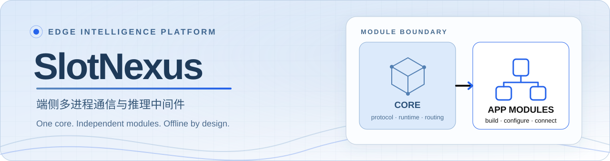
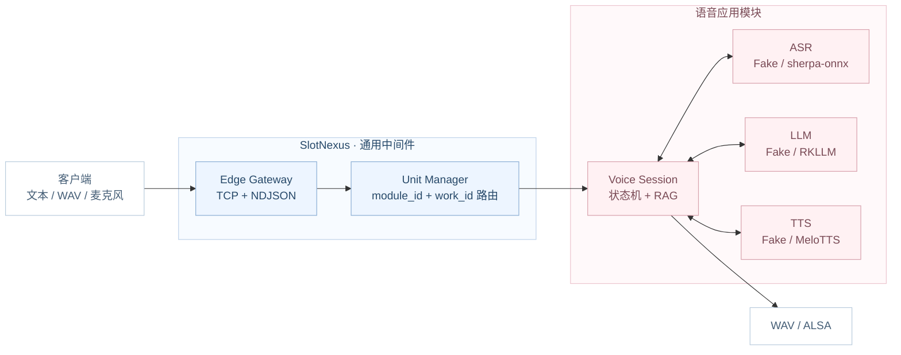
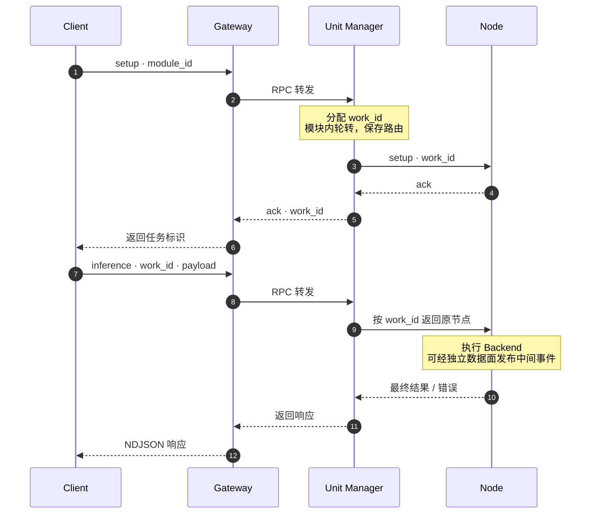

<div align="center">



# SlotNexus

**让端侧模型各司其职，让通信、调度与推理协作有统一底座。**

面向 Linux 边缘设备的多进程通信与推理中间件，首个应用模块是一条全离线语音交互链路。


[快速开始](#快速开始) · [设计动机](#为什么需要这套中间件) · [架构](#架构) · [项目设计](#项目设计) · [模块开发](#模块开发) · [板端部署](#板端部署) · [验证状态](#验证状态)

</div>

> [!NOTE]
> **重构状态**：中间件与语音模块的目录、依赖和构建边界已重构；重构后的泰山派 3M 真实硬件链路正在验证。文中的 30 轮板端数据来自**重构前**的 Qwen3.5-0.8B + MeloTTS 链路，不代表新目录结构已完成同等板端回归。

## 项目概览

SlotNexus 面向**华为昇腾、鲲鹏、瑞芯微 RK 系列、地平线 RDK 系列等 Linux 边缘计算平台**，为低资源环境中的 LLM、ASR、TTS 等模型提供公共通信与任务管理机制。它把模型拆成独立进程，通过统一协议组织协同推理，减少业务代码对节点地址、连接管理和模型接口的直接依赖。

当前以 **RK3576 泰山派 3M（4 GB 内存）**作为实际板端验证平台；其他平台是架构适配目标，尚不能视为已完成硬件验证。

项目自行实现 TCP Reactor、ZeroMQ 传输封装、任务注册与 Node Runtime，把模型之间共用的通信和生命周期能力收敛到可独立构建的中间件。具体模型、音频格式和业务编排由应用模块持有。

| 🧱 通用 Core | 🔌 模块边界 | 🎙️ 语音实例 |
| --- | --- | --- |
| [`middleware/`](middleware/) 提供 Gateway、Unit Manager、Node Runtime、协议与数据面；可单独构建、测试、安装。 | Core 只传递通用 JSON `payload` 与事件；模块通过公开 CMake targets 接入，[边界脚本](scripts/check_core_boundary.sh)检查反向依赖。 | [`modules/voice/`](modules/voice/) 串联 ASR → 本地 RAG → LLM → TTS；默认 Fake Backend 无需模型和声卡。 |

中间件传递不透明 JSON `payload` 和通用事件，不依赖语音模型或 PCM 类型。语音模块可以作为同仓库目标构建，也可以通过已安装的 `slotnexus-core` CMake 包单独构建。模块在**安装、配置并重启服务后**接入；目前没有模块动态加载或自动发现机制。

### 为什么需要这套中间件

直接把 ASR、检索、LLM 和 TTS 串在一个业务进程里，业务代码就必须同时处理模型资源、Socket、线程、流式输出和异常退出。SlotNexus 针对以下问题提供公共机制：

| 端侧常见问题 | 项目中的处理方式 |
| --- | --- |
| 模型争用 CPU、NPU 和内存，一个节点异常影响整条链路 | 模型节点以进程隔离；任务由 Manager 分配并跟踪，故障按节点处理 |
| 模型加载、推理、取消和退出方式各不相同 | 通用 Node Runtime 管理 `setup / inference / cancel / taskinfo / exit` 生命周期，应用模块负责适配具体 Backend |
| 音频帧、识别片段、token 和 PCM 持续产生，容易积压 | 控制面 RPC 与异步数据面分离；队列容量、等待时间和消息尺寸受限 |
| 节点地址与业务调用写死在客户端中，替换节点牵动调用方 | Gateway 提供统一接入；Manager 根据模块配置和 `work_id` 路由，节点端点集中配置 |
| 多轮请求、取消和晚到事件可能串流 | `work_id`、`request_id`、`session_id` 区分任务与请求；语音 Session 用 generation 过滤旧事件 |

当前实现聚焦**单机多进程、离线运行**。通信与推理按进程拆分，通过 TCP / ZeroMQ 协作；Gateway 与内部节点不依赖公网服务。目前不提供跨主机集群或自动故障转移。

### 技术栈

| 层次 | 技术与实现 |
| --- | --- |
| 系统与语言 | Linux · C++17 · RAII · 智能指针 · mutex / atomic |
| 网络与通信 | 非阻塞 Socket · epoll · eventfd · Reactor · ZeroMQ / cppzmq |
| 协议与任务 | NDJSON · nlohmann/json · 状态机 · Backend 工厂注入 · 回调与 Adapter |
| 构建与交付 | CMake Presets · 可安装 CMake package · CTest · Shell · Python 夹具生成 |
| 语音模块 | sherpa-onnx · BM25 · RKLLM · MeloTTS · ONNX Runtime · RKNN · ALSA |

## 架构



板端语音发布形态为 **Gateway、Unit Manager、Session、ASR、LLM、TTS 六进程**。RAG 在 Session 内完成路由，不额外常驻进程。控制请求通过 ZeroMQ RPC 转发；ASR 识别片段、LLM token 和 TTS PCM 由语音适配器转换成通用数据面事件。

ASR、LLM、TTS 节点复用 Core 的 `RuntimeNode`、`TaskRuntime` 和 `IBackend` 契约；Session 在模块内负责业务编排。图中的进程关系与底层公共库相互配合，具体职责见[项目设计](#项目设计)。

## 快速开始

### 环境要求

- Linux 或 WSL2；C++17 编译器；CMake ≥ 3.22；Python 3。
- ZeroMQ C 库与 cppzmq 头文件。Ubuntu 可安装 `libzmq3-dev` 和 `cppzmq-dev`。
- `nlohmann/json` 3.10.5 完整 multi-header 头文件集合已包含在 [`third_party/nlohmann/`](third_party/nlohmann/)，默认构建无需 NPU SDK、模型或音频设备。

### 构建并测试

在仓库根目录运行：

```bash
cmake --preset wsl-debug
cmake --build --preset wsl-debug
ctest --preset wsl-debug -j1
```

测试在构建目录生成最小 WAV 夹具，使用语音模块的示例知识库；无需额外测试资产。E2E 测试会启动本机端口，为避免并行端口竞争，建议按上例串行运行 CTest。

构建完成后，可运行不依赖硬件的 Session 演示：

```bash
bash scripts/demo_mock_session.sh
```

演示覆盖 L0–L3 路由、固定 WAV 输入、任务状态和 WAV 输出，文件写入 `/tmp/slotnexus-session/`。Fake TTS 输出的是验证音频通路的测试音；可读回答见演示输出中的 `final_text`。

### 单独构建中间件与语音模块

```bash
cmake -S . -B build-core -DVOX_BUILD_VOICE=OFF -DVOX_BUILD_TESTS=ON
cmake --build build-core -j4
ctest --test-dir build-core -j1 --output-on-failure
cmake --install build-core --prefix "$PWD/build-core-install"

cmake -S modules/voice -B build-voice \
  -DCMAKE_PREFIX_PATH="$PWD/build-core-install"
cmake --build build-voice -j4
```

独立语音构建通过 `find_package(slotnexus-core CONFIG REQUIRED)` 消费核心安装包。独立构建默认不启用跨进程语音测试；全量测试请使用仓库根目录构建。

## 项目设计

### 01 · Transport：三类通信，各自承担明确职责

**解决的问题**：控制请求需要响应，流式结果需要持续推送，生产者与消费者又可能以不同速度处理数据。通信层为这些交互提供独立封装。

| 通信模式 | 核心封装 | 机制与当前用途 |
| --- | --- | --- |
| REQ / REP | `RpcClient` / `RpcServer` | Gateway → Manager → 节点的控制链路；请求与响应成对处理，服务端通过 Handler 回调接入上层逻辑。 |
| PUB / SUB | `PubSocket` / `SubSocket` | 节点发布流式事件，订阅方按 topic 接收；提供独立的 READY / ACK 握手端点，协调订阅与开始发送的时机。 |
| PUSH / PULL | `PushSocket` / `PullSocket` | 提供带发送、接收超时的消息通道，适合生产者 / 消费者交互；目前作为基础组件测试，语音主链路使用 RPC 与 PUB / SUB。 |

- **超时后可继续调用**：同步 RPC 接收响应超时后，重建 REQ socket 并重新连接，恢复下一次调用需要的 REQ / REP 状态；超时请求的重试由调用方决定。
- **分开发送与等待**：`call_async()` 发送请求，`poll_response()` 分段等待结果。语音网络适配器利用这两个接口，在等待最终响应期间接收数据面事件。
- **统一错误表达**：传输失败映射为 `TransportError`；Gateway 和 Manager 再转换为带请求标识的协议错误，便于沿调用链定位问题。
- **明确资源归属**：Socket 由封装对象持有，`close()` 支持重复调用；RPC 服务端通过关闭标志协调服务循环退出。

代码入口：[RPC](middleware/transport/src/rpc.cpp) · [PUB / SUB](middleware/transport/src/pubsub.cpp) · [PUSH / PULL](middleware/transport/src/pushpull.cpp)

### 02 · Reactor 与 Gateway：从 TCP 字节流到控制请求

**解决的问题**：客户端通过 TCP 接入时，需要处理连接、半包与粘包、慢客户端以及协议错误，让节点专注于任务处理。

| 组件 | 职责 |
| --- | --- |
| `Poller` | 封装 `epoll_ctl` / `epoll_wait`，维护 fd 与事件的注册关系，返回本轮就绪的 Channel。 |
| `Channel` | 描述一个 fd 关注的读、写与错误事件，通过回调分发网络事件。 |
| `EventLoop` | 在所属线程执行事件回调；跨线程任务经队列投递，使用 `eventfd` 唤醒，当前事件批次结束后执行待处理任务。 |
| `TcpServer` / `TcpConnection` | 非阻塞接受连接，维护连接生命周期、增量输入与待发送缓冲；处理部分写入与断开连接。 |
| `NdjsonFrameDecoder` | 按换行增量切分消息，处理半帧、连续多帧与 CRLF；默认单帧上限为 1 MiB。 |
| `EdgeGateway` | 校验 JSON 信封和客户端 action，经 RPC 转发给 Manager，再把响应发回原 TCP 连接。 |

连接设置了输出缓冲上限；客户端持续不读取、导致缓冲超限时，连接会被关闭。Channel 的弱引用保活与事件批次结束后的延迟释放，共同处理回调中关闭连接时的对象生命周期。

当前 Gateway 采用**单 EventLoop Reactor**，接受连接与连接 I/O 共用一个 loop。Manager RPC 转发也在该线程内同步执行，因此一次慢响应会推迟其他连接的事件处理。当前可执行入口监听 `127.0.0.1`，适用于本机客户端接入。

代码入口：[EventLoop](middleware/network/src/event_loop.cpp) · [TcpConnection](middleware/network/src/tcp_connection.cpp) · [Gateway](middleware/services/edge_gateway/edge_gateway.cpp)

### 03 · 协议与数据面：统一关联标识，分离控制与事件

**解决的问题**：多个任务、多个请求与连续事件共用通信基础设施时，需要明确“属于谁、是哪一轮、是否已经结束”。

控制面与数据面共用版本化 JSON `MessageEnvelope`。TCP 入口在 JSON 后追加换行，形成 UTF-8 NDJSON；内部 ZeroMQ 通道直接传输消息。序列化后的单条信封上限为 **1 MiB**。

| 字段 | 作用 |
| --- | --- |
| `version` / `type` | 校验协议版本并区分 `setup`、`inference`、`cancel`、`taskinfo`、`exit`、`event`、`ack`、`error`。 |
| `work_id` | 任务实例标识，用于定位已创建的任务和固定节点路由。 |
| `request_id` / `session_id` | 分别关联单次调用与会话；请求标识贯穿控制链路日志。 |
| `payload` | 模块定义的 JSON 业务负载，Core 负责承载与转发。 |
| `index` / `finish` | 标记流内序号与完成状态，供接收方关联和处理事件。 |
| `timestamp_ms` / `error` | 承载时间戳与结构化错误信息。 |

数据面在信封之上提供 `DataplaneEvent`：由模块定义事件 `kind` 与 JSON 内容，`EventPublisher` 使用 **`<work_id>/<request_id>/`** 作为 topic；没有指定序号时，按流自动生成递增 `index`。订阅方按任务与请求设置 topic 前缀，尾部 `/` 避免相似标识发生前缀误匹配。

语音模块把识别片段、token、PCM 映射为事件，其中 PCM 字节由语音适配器编码。Core 不引入音频类型，未来模块也可以通过同一事件出口传递自己的处理结果。

代码入口：[MessageEnvelope](middleware/protocol/include/slotnexus/protocol/message_envelope.hpp) · [事件通道](middleware/dataplane/src/event_channel.cpp) · [语音网络适配器](modules/voice/backends/net/src/net_backend_session.cpp)

### 04 · Node Runtime：组合任务状态机与 Backend

**解决的问题**：模型接口和执行方式不同，但任务创建、推理、取消、查询与释放的流程可以共用。

```text
RuntimeNode       解析 RPC action，生成 ack / error，发布 Backend 事件
    └─ TaskRuntime    work_id → TaskChannel；通过工厂创建独立 Backend 实例
        └─ TaskChannel    管理单任务状态与在途请求
            └─ IBackend       模块实现 infer()，接收 JSON、deadline、取消标志与事件回调
```

| 生命周期 | 当前行为 |
| --- | --- |
| `setup` | 创建任务与 Backend 实例，保存 setup 负载，状态从 `new` 进入 `ready`。 |
| `inference` | 状态从 `ready` 进入 `busy`，调用 Backend；同一任务再次并发推理时返回 `busy`，完成后恢复 `ready`。 |
| `cancel` | 设置原子取消标志，由 Backend 在执行过程中检查并协作退出。 |
| `taskinfo` | 返回状态、当前请求、推理次数与 setup 负载快照。 |
| `exit` | 终止任务并释放任务表记录；推理过程中退出时同时设置取消标志。 |

`TaskRuntime` 通过工厂注入 Backend，`RuntimeNode` 组合 RPC 服务与任务表；模块通过 Adapter 实现 `IBackend::infer()`。该接口的输入、输出和中间事件都使用 JSON，模型加载、文本处理与音频逻辑由模块安排。

这里的 **`TaskChannel` 管理任务状态，网络层 `Channel` 管理 fd 事件**。任务执行采用同步 `infer()` 入口；deadline 与取消标志要求 Backend 主动检查。Runtime 本身支持并发调用下的状态保护，但当前节点的同步 RPC 服务循环会限制远程取消请求的到达时机。

代码入口：[RuntimeNode](middleware/services/node_host/runtime_node.cpp) · [TaskRuntime](middleware/runtime/src/task_runtime.cpp) · [TaskChannel](middleware/runtime/src/task_channel.cpp) · [IBackend](middleware/runtime/include/slotnexus/runtime/ibackend.hpp)

### 05 · Unit Manager：模块内轮转，任务内固定路由

**解决的问题**：客户端只需选择业务模块，无需掌握具体节点端点；一个有状态任务的后续请求需要始终回到同一节点。

1. **读取模块配置**：启动时加载 `module_id`、节点端点列表等描述，并为配置端点建立可复用的 RPC client。
2. **选择模块**：`setup.payload.module_id` 指定目标模块，省略时使用默认模块；未知模块返回 `unknown_module`。
3. **分配任务**：`TaskRegistry` 在容量限制内生成 `work_id`，Manager 在该模块的节点列表内轮转选择端点。
4. **保存路由**：记录 `work_id → 模块 / 节点`。后续 `inference / cancel / taskinfo / exit` 按此记录转发。
5. **回收记录**：节点 setup 返回错误时撤销本次分配；exit 返回 ack 后释放任务标识与路由。

任务标识在同一个 Registry 实例内单调递增、释放后不复用；模块与路由保存在进程内。当前路由方式由启动配置决定，增加节点后需要重新启动服务；模块描述中的 `protocol_version` 与 `config` 是元数据，不构成自动协议协商或自动部署。

以下时序展示一个普通任务的控制路径：



例如，客户端创建一个语音任务时发送一行 JSON：

```json
{"version":1,"type":"setup","request_id":"setup-1","payload":{"module_id":"voice"}}
```

收到 ack 后保留 `work_id`，后续调用携带该标识，并为每次调用提供相应的 `request_id`。

代码入口：[Unit Manager](middleware/services/unit_manager/unit_manager.cpp) · [TaskRegistry](middleware/task_registry/include/slotnexus/task_registry/task_registry.hpp) · [模块配置示例](modules/voice/config/manager-modules.json)

### 06 · 构建与部署：Core 独立交付，模块持有业务依赖

**解决的问题**：新增应用或更换模型时，需要控制依赖扩散，让核心开发与板端模型集成各有清晰入口。

- **独立构建边界**：`middleware/` 持有通用库与服务；关闭 `VOX_BUILD_VOICE` 后，Core 可以单独构建、测试和安装。语音模块通过公开 CMake targets 或安装后的 `slotnexus-core` package 接入。
- **开发与硬件分开配置**：默认采用 Fake Backend，在 Linux / WSL2 上验证协议、任务和语音编排；板端构建再启用真实 Backend 与厂商 SDK。
- **板端脚本管理交付**：泰山派部署入口提供构建、依赖检查、启动停止与测量回归脚本，管理 Gateway、Manager 与四个语音进程；进程组参数集中在单一共享层，场景脚本不复制启动逻辑。当前交付方式为裸机 Shell 脚本。
- **外部资产按路径提供**：模型、真实知识库与录音由部署配置指定；仓库保留示例知识库，小型测试 WAV 在构建目录生成。
- **依赖边界门禁**：检查 Core 对语音目录和专有类型的反向依赖，并验证默认构建不带入硬件依赖。

代码入口：[核心构建](middleware/CMakeLists.txt) · [语音独立构建](modules/voice/CMakeLists.txt) · [边界检查](scripts/check_core_boundary.sh) · [板端部署脚本](modules/voice/deploy/taishanpi3m/)

## 模块开发

新增业务模块的目录模板、Core target 选择、`IBackend` 接入方式、请求与事件约定，以及独立构建命令见 [`middleware/MODULE_INTEGRATION.md`](middleware/MODULE_INTEGRATION.md)。下面保留当前模块边界和运行流程的概览。

新应用模块沿用 `modules/<name>/` 的组织方式，依赖中间件公开 CMake targets 和通用 JSON/事件契约，而不是让核心包含模块的业务类型。接入时需要：

1. 实现节点和 Backend 适配，定义模块自己的请求 `payload` 与事件 `kind`。
2. 使用已安装的 `slotnexus-core` 构建模块，并准备模块配置和节点端点。
3. 在 Manager 配置中登记稳定的 `module_id`、协议版本和节点端点，再部署、重启相关服务。

当前语音描述示例见 [`manager-modules.json`](modules/voice/config/manager-modules.json)。Manager 也保留 `--module-id`、`--default-module`、`--node` 参数兼容旧单模块脚本。**第二个业务模块尚未做端到端接入验证**；“新增模块无需修改核心源码”是当前接口的设计目标。

## 语音模块

语音模块是这套公共机制的首个完整应用：Session 组织交互流程，ASR、LLM、TTS 节点完成模型处理，模型之间通过 RPC 与数据面事件协作。

| 环节 | 默认开发构建 | 板端真实 Backend |
| --- | --- | --- |
| ASR | Fake ASR | sherpa-onnx 流式识别 |
| 检索 | JSONL + BM25，L0–L3 路由 | 同一模块实现 |
| LLM | Fake LLM | RKLLM；当前配置为 Qwen3.5-0.8B W4A16 G128 |
| TTS | Fake TTS | MeloTTS：ONNX Runtime CPU 编码器 + RKNN NPU 解码器 |
| 输出 | WAV 测试输出 | WAV / ALSA |

当前真实 TTS 为 **MeloTTS**。SummerTTS 已退出当前构建与部署路径，只作为上一代历史基线。示例知识库见 [`examples/knowledge.jsonl`](modules/voice/examples/knowledge.jsonl)；真实模型、知识库与录音由部署环境提供，不入库。模型与外部依赖说明见 [`modules/voice/models/README.md`](modules/voice/models/README.md)。

### 一次语音交互如何完成

1. **输入**：客户端提供文本、WAV，或通过 `mode=stream` / `mode=continuous` 使用麦克风。`stream` 在单次请求内做 VAD 判停；`continuous` 由客户端显式启动常驻会话，后续每段话语独立成轮；音频输入经 ASR 转成文本。
2. **路由**：Session 在进程内执行本地 RAG 路由：L0 规则控制、L1 高置信事实直答、L2 带检索上下文生成、L3 普通生成。
3. **生成**：需要模型回答时调用 LLM；网络适配器在等待 RPC 最终响应期间接收 token 等数据面事件。
4. **合成与输出**：回答交给 TTS，使用 WAV / ALSA 输出。文本、音频与模型 SDK 的适配全部留在语音模块内。
5. **状态管理**：Session 管理 Listening、Routing、Thinking、Speaking 等状态；取消后通过 generation 过滤上一轮晚到事件。

模块内还保留独立 `rag_node` 入口；当前六进程部署由 Session 内部执行检索与路由。

## 板端部署

验证平台是泰山派 3M（RK3576，4 GB）。真实 Backend 需要对应的 sherpa-onnx、RKLLM、ONNX Runtime、RKNN、ALSA、模型和板端 Runtime；默认开发构建不需要这些依赖。

板端入口位于 [`modules/voice/deploy/taishanpi3m/`](modules/voice/deploy/taishanpi3m/)：`build.sh hardware` 负责原生构建与测试，`check_deployment.sh` 检查依赖和模型，`start.sh`/`stop.sh` 管理六个服务，`run.sh` 用一个入口提供测量与回归场景。六个服务的启动参数、优雅退出、探测与资源采样集中在 [`common.sh`](modules/voice/deploy/taishanpi3m/common.sh)，场景脚本只描述测什么、断言什么。部署前按 [`deploy-manifest.md`](modules/voice/deploy/taishanpi3m/deploy-manifest.md) 准备外部资产。硬件配置模板见 [`session.json`](modules/voice/config/taishanpi3m/session.json)。

输出目标由 `SLOTNEXUS_SINK` 选择：`wav`（默认，写文件供内容复核）或 `alsa`（实时声卡播放，设备名用 `SLOTNEXUS_SINK_DEVICE` 指定）。两种模式使用同一份模型、路由与回答文本，只有出口不同。

测量与回归默认不注入人工阶段等待（`--stage-delay-ms` 为 0，需要模拟慢消费时用 `SLOTNEXUS_STAGE_DELAY_MS` 显式设置），否则阶段耗时会包含测试脚本自己造出的等待：

| `run.sh` 场景 | 用途 |
| --- | --- |
| `baseline [目录]` | 六进程启动、模型加载、节点握手、任务 setup 与推理各阶段耗时、RSS/温度，并记录源码与构建指纹 |
| `wav` | 固定 WAV 全链路回归（demo_zh + 官方 0.wav，ASR/RKLLM/MeloTTS） |
| `mic` | 现场麦克风连续采集 + VAD 判停（对板载麦克风说话，静音后自动结束本轮） |
| `stability [轮次]` | 每轮重建六进程的重复可用性回归（默认 30 轮） |
| `inject` | 取消 / 节点超时 / 错误输入 |
| `llm` | 仅 llm_node 的固定 prompt 核验 |
| `mock` | Fake Backend 会话链（default 构建产物，板上快速自检） |

## 验证状态

| 范围 | 当前证据与边界 |
| --- | --- |
| WSL 默认构建 | 当前 54/54 CTest 串行通过，包含原有行为测试、Manager 路由、核心边界门禁与部署测量脚本契约。 |
| 核心独立构建 | 重构验收记录为 17/17 CTest 通过，并完成核心安装与语音模块独立消费者构建。 |
| 板端历史基线 | 重构前 Qwen3.5-0.8B + MeloTTS 固定输入 30/30 成功；端到端 p50 59.4 s、p95 60.8 s。**每轮都重建六进程**，不是六进程常驻 30 轮。 |
| 重构后板端链路 | **验证进行中**；真实 ASR/LLM/TTS、麦克风/声卡及 30 轮链路结果以本轮板端测试为准。 |

历史基线只适用于当时的模型、Runtime、输入与测试方式。上一代 1.5B + SummerTTS 数据不与当前链路混算。

### 已知边界

- 系统面向**单机多进程**，目前不提供跨主机集群、自动故障转移或模块动态加载与热插拔。
- PUB / SUB 提供订阅握手与事件关联，不提供持久化、断线补发或可靠投递确认；当前没有高并发容量或端到端加速比例的压测结论。
- 同步 REQ/REP 转发期间，正在执行推理的节点不能通过同一通道插队处理 cancel；语音 L0 规则处理停止类请求，不能等同于任意阶段的抢占式中断。
- 麦克风入口支持逐帧 ASR 与 VAD 判停。`mode=stream` 仍是单次推理请求内的连续采集；`mode=continuous` 显式启动后在同一任务会话内保持常驻采集与多轮独立响应，达到休眠词、跟进空闲、会话总时长或最大轮数后回到 sleeping。当前不使用语音唤醒词或 KWS。
- ALSA 输出目前按整轮 PCM 依次写入，没有独立的起音前缓冲或播放中抢占；“真实扬声器首音”需要录音或回环才能测，软件写入时间不等于实际出声。
- 当前板端真实链路需要外部厂商 Runtime 和模型；硬件测试结果不能由 Fake Backend 回归代替。

## 仓库结构

```text
middleware/           通用库、CMake 安装包、Gateway、Manager 与 Node Runtime 服务
modules/voice/        语音 Backend、Session 编排、配置、部署脚本和语音测试
tests/core/           中间件单元、集成与边界测试
scripts/              开发演示、资产生成与依赖检查
third_party/          内嵌 nlohmann/json 头文件
```

## 许可与作者

项目自有代码采用 [MIT License](LICENSE)，作者 **Caden**。第三方组件、模型来源与分发边界见 [`THIRD_PARTY_NOTICES.md`](THIRD_PARTY_NOTICES.md)。
