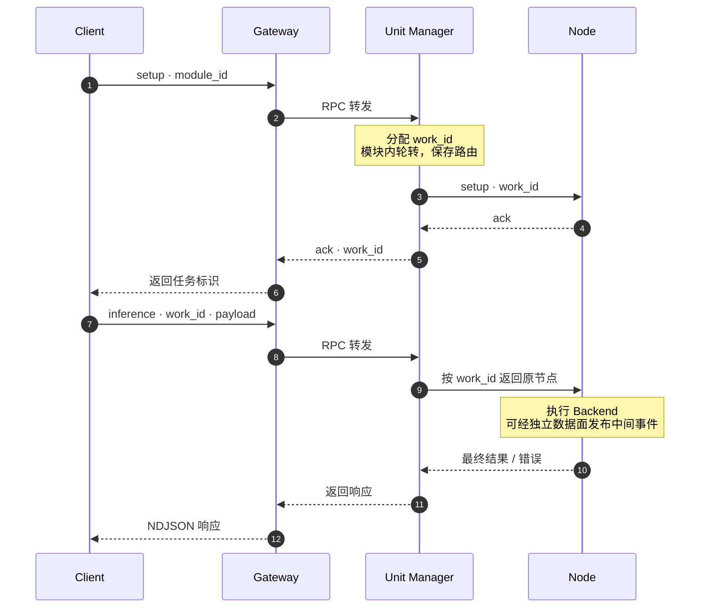

# SlotNexus 项目设计

[返回中文首页](../README.md) · [English overview](../README.en.md#architecture)


### 01 · Transport：三类通信，各自承担明确职责

**解决的问题**：控制请求需要响应，流式结果需要持续推送，生产者与消费者又可能以不同速度处理数据。通信层为这些交互提供独立封装。

| 通信模式 | 核心封装 | 机制与当前用途 |
| --- | --- | --- |
| REQ / REP | `RpcClient` / `RpcServer` | Gateway → Manager → 节点的控制链路；请求与响应成对处理，服务端通过 Handler 回调接入上层逻辑。 |
| PUB / SUB | `PubSocket` / `SubSocket` | 节点发布流式事件，订阅方按 topic 接收；提供独立的 READY / ACK 握手端点，协调订阅与开始发送的时机。 |
| PUSH / PULL | `PushSocket` / `PullSocket` | 提供带发送、接收超时的单向消息通道；当前用于 Session → ASR 节点的逐帧上行，基础测试也覆盖超时与关闭行为。 |

- **超时后可继续调用**：同步 RPC 接收响应超时后，重建 REQ socket 并重新连接，恢复下一次调用需要的 REQ / REP 状态；超时请求的重试由调用方决定。
- **分开发送与等待**：`call_async()` 发送请求，`poll_response()` 分段等待结果。语音网络适配器利用这两个接口，在等待最终响应期间接收数据面事件。
- **统一错误表达**：传输失败映射为 `TransportError`；Gateway 和 Manager 再转换为带请求标识的协议错误，便于沿调用链定位问题。
- **明确资源归属**：Socket 由封装对象持有，`close()` 支持重复调用；RPC 服务端通过关闭标志协调服务循环退出。

代码入口：[RPC](../middleware/transport/src/rpc.cpp) · [PUB / SUB](../middleware/transport/src/pubsub.cpp) · [PUSH / PULL](../middleware/transport/src/pushpull.cpp)

### 02 · Reactor 与 Gateway：从 TCP 字节流到控制请求

**解决的问题**：客户端通过 TCP 接入时，需要处理连接、半包与粘包、慢客户端以及协议错误，让节点专注于任务处理。

| 组件 | 职责 |
| --- | --- |
| `Poller` | 封装 `epoll_ctl` / `epoll_wait`，维护 fd 与事件的注册关系，返回本轮就绪的 Channel。 |
| `Channel` | 描述一个 fd 关注的读、写与错误事件，通过回调分发网络事件。 |
| `EventLoop` | 在所属线程执行事件回调；跨线程任务经队列投递，使用 `eventfd` 唤醒，当前事件批次结束后执行待处理任务。 |
| `TcpServer` / `TcpConnection` | 非阻塞接受连接，维护连接生命周期、增量输入与待发送缓冲；处理部分写入与断开连接。 |
| `NdjsonFrameDecoder` | 按换行增量切分消息，处理半帧、连续多帧与 CRLF；默认单帧上限为 1 MiB。 |
| `EdgeGateway` | 校验 JSON 信封和客户端 action，经 RPC 转发给 Manager，再把响应发回原 TCP 连接。 |

连接设置了输出缓冲上限；客户端持续不读取、导致缓冲超限时，连接会被关闭。Channel 的弱引用保活与事件批次结束后的延迟释放，共同处理回调中关闭连接时的对象生命周期。

当前 Gateway 采用**单 EventLoop Reactor**，接受连接与连接 I/O 共用一个 loop。Manager RPC 转发也在该线程内同步执行，因此一次慢响应会推迟其他连接的事件处理。当前可执行入口监听 `127.0.0.1`，适用于本机客户端接入。

代码入口：[EventLoop](../middleware/network/src/event_loop.cpp) · [TcpConnection](../middleware/network/src/tcp_connection.cpp) · [Gateway](../middleware/services/edge_gateway/edge_gateway.cpp)

### 03 · 协议与数据面：统一关联标识，分离控制与事件

**解决的问题**：多个任务、多个请求与连续事件共用通信基础设施时，需要明确“属于谁、是哪一轮、是否已经结束”。

控制面与数据面共用版本化 JSON `MessageEnvelope`。TCP 入口在 JSON 后追加换行，形成 UTF-8 NDJSON；内部 ZeroMQ 通道直接传输消息。序列化后的单条信封上限为 **1 MiB**。

| 字段 | 作用 |
| --- | --- |
| `version` / `type` | 校验协议版本并区分 `setup`、`inference`、`cancel`、`taskinfo`、`exit`、`event`、`ack`、`error`。 |
| `work_id` | 任务实例标识，用于定位已创建的任务和固定节点路由。 |
| `request_id` / `session_id` | 分别关联单次调用与会话；请求标识贯穿控制链路日志。 |
| `payload` | 模块定义的 JSON 业务负载，Core 负责承载与转发。 |
| `index` / `finish` | 标记流内序号与完成状态，供接收方关联和处理事件。 |
| `timestamp_ms` / `error` | 承载时间戳与结构化错误信息。 |

数据面在信封之上提供 `DataplaneEvent`：由模块定义事件 `kind` 与 JSON 内容，`EventPublisher` 使用 **`<work_id>/<request_id>/`** 作为 topic；没有指定序号时，按流自动生成递增 `index`。订阅方按任务与请求设置 topic 前缀，尾部 `/` 避免相似标识发生前缀误匹配。

语音模块把识别片段、token、PCM 映射为事件，其中 PCM 字节由语音适配器编码。Core 不引入音频类型，未来模块也可以通过同一事件出口传递自己的处理结果。

代码入口：[MessageEnvelope](../middleware/protocol/include/slotnexus/protocol/message_envelope.hpp) · [事件通道](../middleware/dataplane/src/event_channel.cpp) · [语音网络适配器](../modules/voice/backends/net/src/net_backend_session.cpp)

### 04 · Node Runtime：组合任务状态机与 Backend

**解决的问题**：模型接口和执行方式不同，但任务创建、推理、取消、查询与释放的流程可以共用。

```text
RuntimeNode       解析 RPC action，生成 ack / error，发布 Backend 事件
    └─ TaskRuntime    work_id → TaskChannel；通过工厂创建独立 Backend 实例
        └─ TaskChannel    管理单任务状态与在途请求
            └─ IBackend       模块实现 infer()，接收 JSON、deadline、取消标志与事件回调
```

| 生命周期 | 当前行为 |
| --- | --- |
| `setup` | 创建任务与 Backend 实例，保存 setup 负载，状态从 `new` 进入 `ready`。 |
| `inference` | 状态从 `ready` 进入 `busy`，调用 Backend；同一任务再次并发推理时返回 `busy`，完成后恢复 `ready`。 |
| `cancel` | 设置原子取消标志，由 Backend 在执行过程中检查并协作退出。 |
| `taskinfo` | 返回状态、当前请求、推理次数与 setup 负载快照。 |
| `exit` | 终止任务并释放任务表记录；推理过程中退出时同时设置取消标志。 |

`TaskRuntime` 通过工厂注入 Backend，`RuntimeNode` 组合 RPC 服务与任务表；模块通过 Adapter 实现 `IBackend::infer()`。该接口的输入、输出和中间事件都使用 JSON，模型加载、文本处理与音频逻辑由模块安排。

这里的 **`TaskChannel` 管理任务状态，网络层 `Channel` 管理 fd 事件**。任务执行采用同步 `infer()` 入口；deadline 与取消标志要求 Backend 主动检查。Runtime 本身支持并发调用下的状态保护，但当前节点的同步 RPC 服务循环会限制远程取消请求的到达时机。

代码入口：[RuntimeNode](../middleware/services/node_host/runtime_node.cpp) · [TaskRuntime](../middleware/runtime/src/task_runtime.cpp) · [TaskChannel](../middleware/runtime/src/task_channel.cpp) · [IBackend](../middleware/runtime/include/slotnexus/runtime/ibackend.hpp)

### 05 · Unit Manager：模块内轮转，任务内固定路由

**解决的问题**：客户端只需选择业务模块，无需掌握具体节点端点；一个有状态任务的后续请求需要始终回到同一节点。

1. **读取模块配置**：启动时加载 `module_id`、节点端点列表等描述，并为配置端点建立可复用的 RPC client。
2. **选择模块**：`setup.payload.module_id` 指定目标模块，省略时使用默认模块；未知模块返回 `unknown_module`。
3. **分配任务**：`TaskRegistry` 在容量限制内生成 `work_id`，Manager 在该模块的节点列表内轮转选择端点。
4. **保存路由**：记录 `work_id → 模块 / 节点`。后续 `inference / cancel / taskinfo / exit` 按此记录转发。
5. **回收记录**：节点 setup 返回错误时撤销本次分配；exit 返回 ack 后释放任务标识与路由。

任务标识在同一个 Registry 实例内单调递增、释放后不复用；模块与路由保存在进程内。当前路由方式由启动配置决定，增加节点后需要重新启动服务；模块描述中的 `protocol_version` 与 `config` 是元数据，不构成自动协议协商或自动部署。

以下时序展示一个普通任务的控制路径：



例如，客户端创建一个语音任务时发送一行 JSON：

```json
{"version":1,"type":"setup","request_id":"setup-1","payload":{"module_id":"voice"}}
```

收到 ack 后保留 `work_id`，后续调用携带该标识，并为每次调用提供相应的 `request_id`。

代码入口：[Unit Manager](../middleware/services/unit_manager/unit_manager.cpp) · [TaskRegistry](../middleware/task_registry/include/slotnexus/task_registry/task_registry.hpp) · [模块配置示例](../modules/voice/config/manager-modules.json)

### 06 · 构建与部署：Core 独立交付，模块持有业务依赖

**解决的问题**：新增应用或更换模型时，需要控制依赖扩散，让核心开发与板端模型集成各有清晰入口。

- **独立构建边界**：`middleware/` 持有通用库与服务；关闭 `VOX_BUILD_VOICE` 后，Core 可以单独构建、测试和安装。语音模块通过公开 CMake targets 或安装后的 `slotnexus-core` package 接入。
- **开发与硬件分开配置**：默认采用 Fake Backend，在 Linux / WSL2 上验证协议、任务和语音编排；板端构建再启用真实 Backend 与厂商 SDK。
- **板端脚本管理交付**：泰山派部署入口提供构建、依赖检查、启动停止与测量回归脚本，管理 Gateway、Manager 与四个语音进程；进程组参数集中在单一共享层，场景脚本不复制启动逻辑。当前交付方式为裸机 Shell 脚本。
- **外部资产按路径提供**：模型、真实知识库与录音由部署配置指定；仓库保留示例知识库，小型测试 WAV 在构建目录生成。
- **依赖边界门禁**：检查 Core 对语音目录和专有类型的反向依赖，并验证默认构建不带入硬件依赖。

代码入口：[核心构建](../middleware/CMakeLists.txt) · [语音独立构建](../modules/voice/CMakeLists.txt) · [边界检查](../scripts/check_core_boundary.sh) · [板端部署脚本](../modules/voice/deploy/taishanpi3m/)
